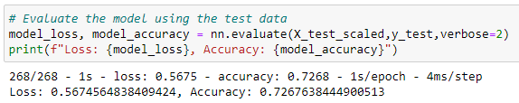

# Neural_Network_Charity_Analysis

## Project Overiew
The purpose of this analysis is to help a non-profit foundation, AlphabetSoup, to invest smartly in a pool of potential recipient organizations. I set out to design and train a deep learning neural network. This model can evaluate all kinds of input data and produce a clear, decision-making result. I employed my past experience with statistics and machine learning to help test and optimize my models. I have created a robust deep learning neural network capable of interpreting large, complex datasets. This will assist AlphabetSoup in determining which organizations should receive donations.

## Resources
- Data sources: charity_data.csv
- Software: Jupyter Notebook: 6.3.0, Visual Studio Code 1.60.2

## Results
### Data Preprocessing
- There is one target variable of my model. From the charity_data.csv file, the target variable for my model is the IS_SUCCESSFUL variable. We want AlphabetSoup to invest in startups who use their investments to help get the organization's feet off the ground and find success. Based on past data, the indicator of whether or not an organization meets this standard is if they are denoted as having an affirmative "yes" in the IS_SUCCESSFUL column of the charity_data dataset.
- The features of my model are APPLICATION_TYPE, CLASSIFICATION, USE_CASE, ORGANIZATION, STATUS, INCOME_AMT, and ASK_AMT
- I found that EIN and NAME were niether targets nor features, and removed them from the input data. Along the way in my three attempts to get my model up to 75% accuracy, I also ended up removing SPECIAL_CONSIDERATIONS and AFFILIATION.

### Compiling, Training, and Evaluating the Model
- In my initial neural network model, I used 2 layers. The first comprised of 50 neurons, and the second had 25. I used a ReLU activation function for both, and then I used a sigmoid activation function on the output layer. I figured 50 and 25 neurons in the first two hidden layers, respectively, would be sufficient in working with the nonlinear data. I thought 25 neurons was an appropriate amount for the second layer, to re-weight the inputs in the first layer.

- I was close, but not entirely able to reach my goal of 75% accuracy from my model. I reached 72.8% accuracy on my test data through my model
- To try to increase the model performance, I first tried simply adding more neurons to my intial two hidden layers. I bumped the first layer up to 75 neurons and the second layer to 50. All other variables were held constant. I found no greater success in improved accuracy; I reached 72.7% accuracy with this new model. Effictively, with additional neurons in the same amount of hidden layers, I found no difference in terms of success in accuracy from my model. 

- In my second attempt, I removed what I deemed to be "noisy variables" in the exclusion of SPECIAL_CONSIDERATIONS and AFFILIATION in my learning model. Additionally, I added a third hidden layer to my model. I bumped the first layer up to 80 neurons; the second to 60 neurons; and the third to 25 neurons. Even with so many more new neurons and an entirely new hidden layer in my model, as well as a reduction in noisy variables, my model only reached 73.1% accuracy. I still fell short of my 75% accuracy goal.

- Finally, in my third attempt, I tried a new activation function in a new, fourth hidden layer in my model. The first layer stayed at 80 neurons; the second, 25; the third, 10; and the fourth, 3. I set the activation function for the fourth layer to be Leaky ReLU, to see if this sort of activation function would help steer my model in the right direction toward improved accuracy. It did not. Unfortunately, my model's accuracy actually took a deep hit, and relayed a 65.3% accuracy.

## Summary
At its best, my deep learning model is able to be  73.1% accurate in predicting success in providing loans to potential organizational applicants.

### Alternative Models
I believe my model could find success in accurately predicting successful applicants to receive loans 75% of the time with a few tweaks. Most importantly, I believe the removal of a few more features that I believe to be noisy, like STATUS and ASK_AMT, could help streamline my model's performance. In a more nit-picky sense, we could test around different values in the hidden layers of the model and even the number of hidden layers themselves to improve accuracy. A lot of fine-tuning that can only be executed manually could shape the model up into a better state, but it would be time and resource-costly, I posit.